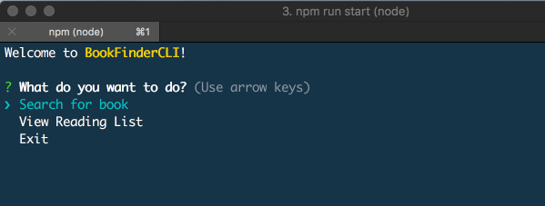
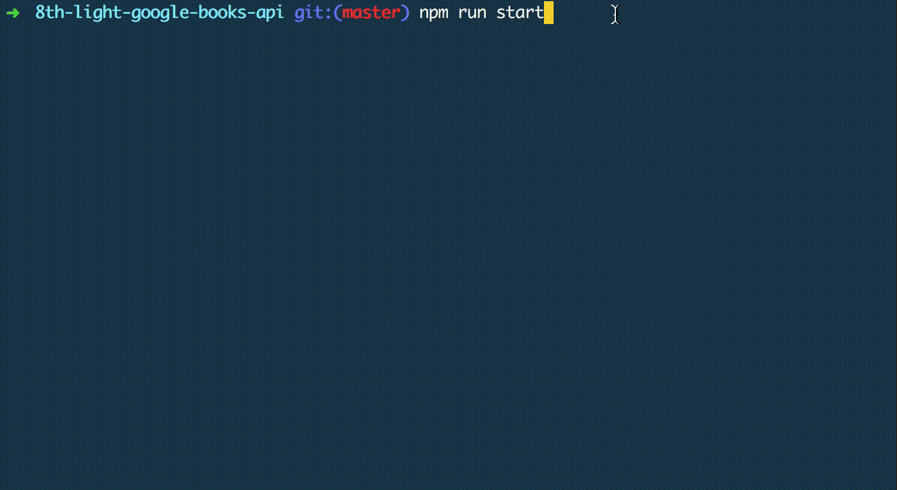
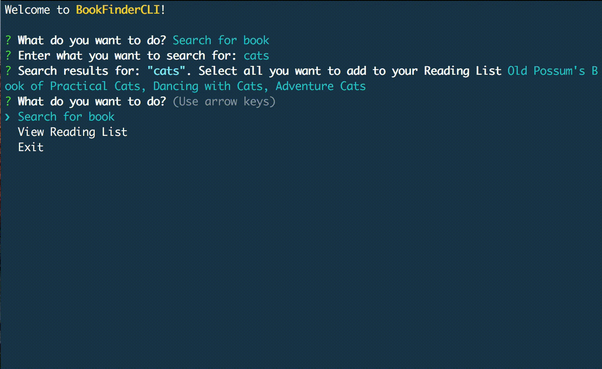
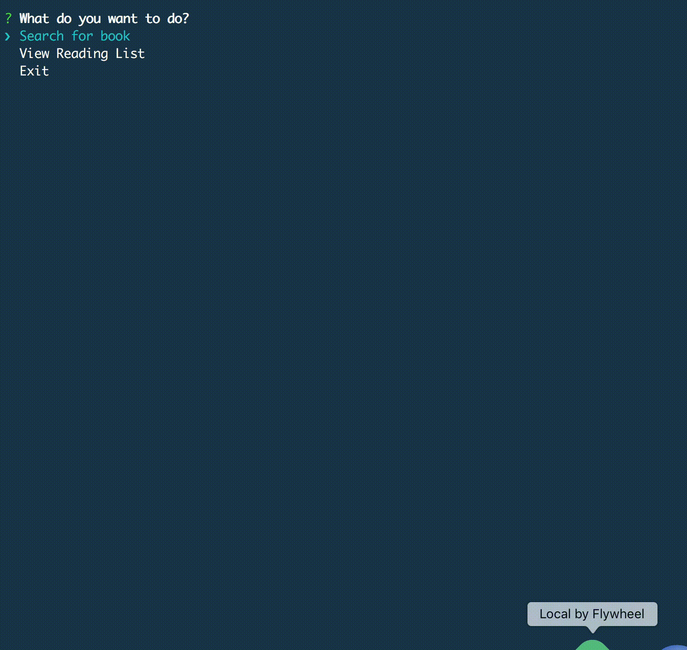

## BookFinderCLI



### Description

BookFinderCLI is a CLI search tool which enables you to query the Google Books API and save the books retrieved to your own local reading list.

### Functionality

This application enables the user to:

- Type in a query and display a list of 5 books matching that query.
- Each item in the list includes the book's author, title, and publishing company.
- Select a book or books from the five search results displayed and save to a “Reading List”
- View a “Reading List” with all the books the user has selected from their queries -- this is a local reading list and not tied to Google Books’s account features.

Search for books, select and add to Reading List



Will notify if book(s) aleady in Reading List



View Reading List



### Install and Run

#### Install

```
npm i
```

Create ability to run program (Shell Command) by typing `bookfinder` in command line from any directory.

```
npm link
```

#### Uninstall

Remove ability to run program by typing `bookfinder` in command line from any directory.

```
npm unlink
```

#### Run Program

```
bookfinder
```

Or

```
npm run start
```

### Technologies Used

- [Inquirer](https://www.npmjs.com/package/inquirer) - handle question / answer
- [Axios](https://www.npmjs.com/package/axios) - get data from api
- [Chalk](https://www.npmjs.com/package/chalk) - add color
- [Eslint](https://eslint.org/) - linting
- [Prettier](https://prettier.io/) - code formatting

### Developer Notes

- **JSON file for storage** - Since the amount of data to save was not that much and that another developer would be testing my code, I chose to save data to JSON file. There was no need to go through the extra steps of creating a db.

### Tasks Completed Since First Iteration

- Removed `/data` folder from `.gitignore` so that can now save to `list.json`.
- Styling and formatting
  - Add color to output
  - Add white space
- Added error handling for when no books results are returned
- Refactored `bookCli` and many other parts of the code
- Wrote tests for `removeBoundaryQuotes` and `formatBookOutput`
